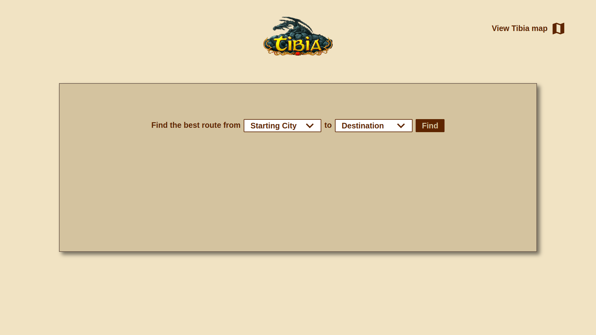
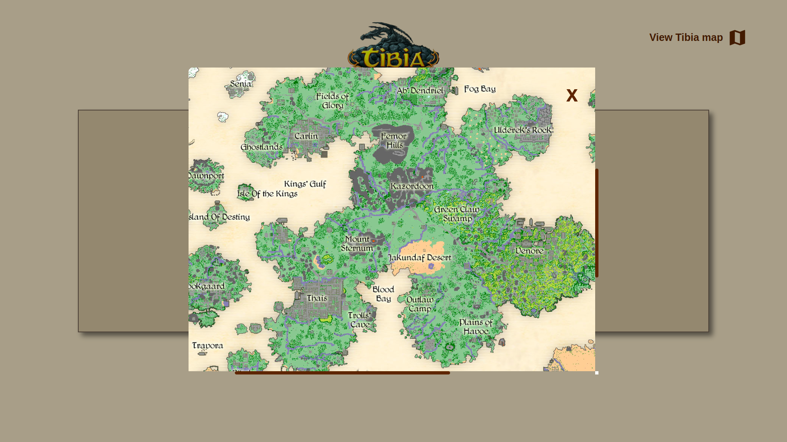
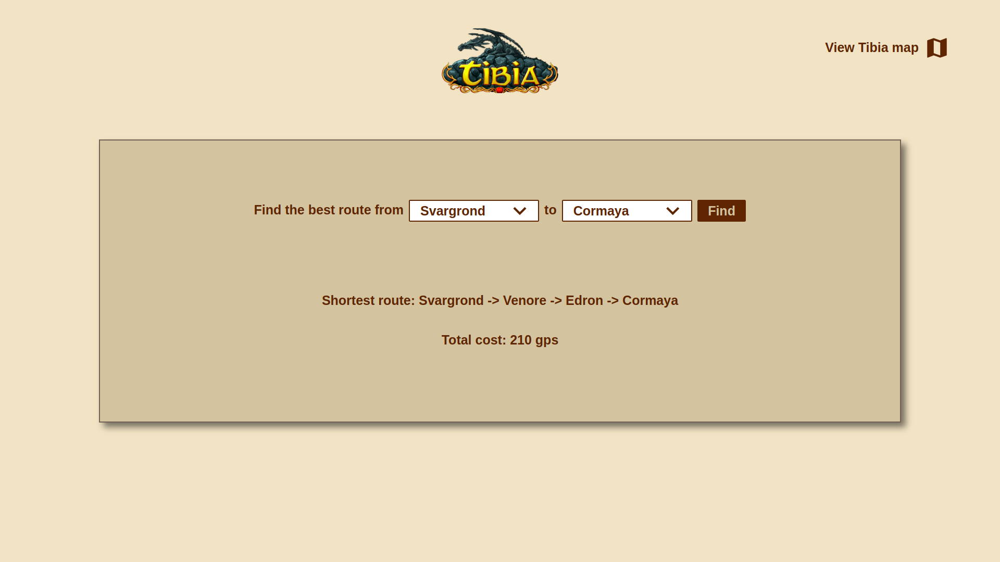

# Grafos2_TibiaRoutes
 

# TibiaRoutes

**Número da Lista**: 45<br>
**Conteúdo da Disciplina**: Grafos 2<br>

## Alunos
| Matrícula  | Aluno                       |
| ---------- | --------------------------- |
| 19/0036761| Pedro Victor Lima Torreão |
| 17/0114929 | Thiago França Vale Oliveira |

## Sobre
Tibia é um jogo do gênero MMORPG lançado em 1997. Nesse mundo de fantasias, existem diversas regiões e cidade espalhadas em um enorme, o jogo conta com diversos meios de transporte para que os jogadores possam viajar de uma cidade para outra, mas nenhum meio é melhor e mais comum que o barco. Utilizar um barco no jogo pode te levar instananêamente de um cidade para outra por uma certa quantia de ouro e a maiorias das grandes cidades possui ao menos um barco para que se possa viajar, porém, só é possível viajar para algumas cidades específicas a partir de cada cidade, podendo gerar confusão e frustração nos jogadores por não encontrarem o barco necessário para alcançar o destino desejado.
Esse projeto tem como objetivo encontrar a menor e mais barata rota entre uma cidade e outra usando o algoritmo de dijkstra e um grafo onde os nós são as cidades, as arestas suas conexões e o peso o preço da passagem.
## Screenshots



*Figura 1: Página inicial do site*



*Figura 2: Modal do mapa do jogo*



*Figura 3: Página inicial após a escolha das cidades*

## Vídeo de Apresentação


## Instalação 
**Linguagem**: Typescript<br>
**Framework**: React<br>

### Clonando o repositório

Para clonar o repositório digite:

```console
git clone https://github.com/projeto-de-algoritmos/Grafos2_TibiaRoutes.git
```
### Instalando as dependências

Após clonar o repositório baixe as dependências
```console
yarn install
```
ou
```console
npm i
```
### Executando o programa

Para execurtar o programa execute o comando:
```console
yarn start
```
ou
```console
npm start
```
Após realizar esses passos, a plataforma estará rodando na [porta 3000](http://localhost:3000/)
## Uso 

Para encontrar a melhor rota basta escolher a cidade inicial e o destino desejado nos dropdowns no centro da página, feito isso, basta clicar no botão "Find" para encontrar a rota. No canto superior direito da página tem um botão que abre um mapa do jogo para ajudar os usuários a se localizarem nesse mundo.

## Outros 
Algumas das cidades do Tibia não podem ser acessadas via barco, por isso não aparecem no dropdown de seleção.
